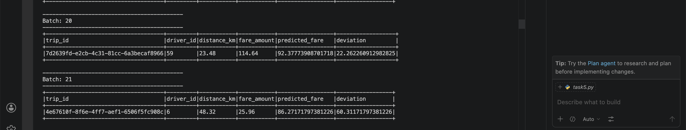
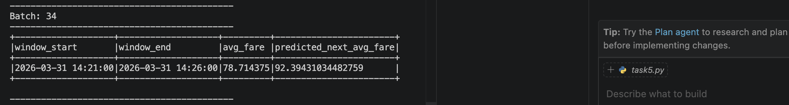
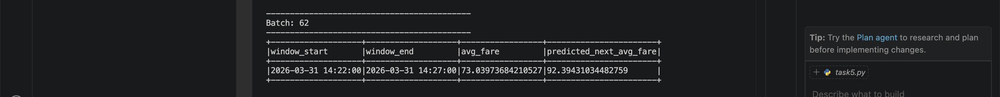

# Handson-L10: Spark Structured Streaming + Machine Learning with MLlib

---

## **Prerequisites**

Before starting the assignment, ensure you have the following installed:

1. **Python 3.x**:

```bash
   python3 --version
```

2. **PySpark 3.5.1**:

```bash
   pip install pyspark==3.5.1
```

3. **Faker**:

```bash
   pip install faker
```

4. **Java 11**:

```bash
   brew install openjdk@11
   export JAVA_HOME=/opt/homebrew/opt/openjdk@11
   export PATH=$JAVA_HOME/bin:$PATH
```

---

## **Project Structure**

```
Handson-L10-Spark-Streaming-MachineLearning-MLlib/
├── models/
│   ├── fare_model/           → Saved LinearRegression model for Task 4
│   └── fare_trend_model_v2/  → Saved LinearRegression model for Task 5
├── outputs/
│   ├── task_4/               → CSV output files for Task 4
│   └── task_5/               → CSV output files for Task 5
├── images/
│   ├── task4_output.png      → Task 4 console output screenshot
│   ├── task5_output_screenshot1.png → Task 5 output screenshot 1
│   └── task5_output_screenshot2.png → Task 5 output screenshot 2
├── data_generator.py         → Streams live ride-sharing data via socket
├── training-dataset.csv      → Static dataset for offline model training
├── task4.py                  → Real-Time Fare Prediction
├── task5.py                  → Time-Based Fare Trend Prediction
└── README.md
```

---

## **Overview**

This assignment continues the real-time analytics pipeline for a ride-sharing platform using **Apache Spark Structured Streaming** and **Spark MLlib**. We train ML models offline and use them to make real-time predictions on streaming data.

---

## **Running the Tasks**

> **Important**: Set Java 11 before running any task:
>
> ```bash
> export JAVA_HOME=/opt/homebrew/opt/openjdk@11
> export PATH=$JAVA_HOME/bin:$PATH
> ```

1. **Start data generator** in Terminal 1 (keep running):

```bash
   python data_generator.py
```

2. **Run Task 4** in Terminal 2:

```bash
   python task4.py
```

3. **Run Task 5** in Terminal 3:

```bash
   python task5.py
```

---

## **Task 4: Real-Time Fare Prediction Using MLlib Regression**

### Approach:

1. **Offline Training**: Loaded `training-dataset.csv`, used `VectorAssembler` to prepare `distance_km` as feature, trained a `LinearRegression` model to predict `fare_amount`, and saved the model to `models/fare_model`.
2. **Real-Time Inference**: Loaded the saved model, applied it to the live stream, and calculated the deviation between actual and predicted fare to identify anomalies.

### Output:

Shows `trip_id`, `driver_id`, `distance_km`, `fare_amount`, `predicted_fare`, and `deviation` for each incoming ride in real time.

### Task 4 Output Screenshot:



**Result Explanation:**
The model predicts fare based on `distance_km`. For example, a trip of 23.48 km has an actual fare of 114.64 but predicted fare of 92.37, giving a deviation of 22.26. Another trip of 48.32 km has an actual fare of 25.96 but predicted fare of 86.27, giving a deviation of 60.31 which is indicating a potential fare anomaly.

---

## **Task 5: Time-Based Fare Trend Prediction**

### Approach:

1. **Offline Training**: Aggregated `training-dataset.csv` into 5-minute windows, calculated `avg_fare`, engineered `hour_of_day` and `minute_of_hour` features, trained a `LinearRegression` model, and saved it to `models/fare_trend_model_v2`.
2. **Real-Time Inference**: Applied the same 5-minute windowed aggregation and feature engineering to the live stream, then used the model to predict `avg_fare` for each window.

### Output:

Shows `window_start`, `window_end`, `avg_fare`, and `predicted_next_avg_fare` every 5 minutes.

### Task 5 Output Screenshot:




**Result Explanation:**
For the window 14:21-14:26, the actual avg fare was 78.71 and the model predicted 92.39 for the next window. A second window 14:22-14:27 shows avg fare of 73.03 with the same prediction of 92.39 which is showing the fare trend for that time period.

---

## **Errors and Resolutions**

### 1. UnsupportedOperationException: getSubject is not supported

**Cause**: Java 21+ incompatibility with PySpark.  
**Fix**:

```bash
pip install pyspark==3.5.1
brew install openjdk@11
export JAVA_HOME=/opt/homebrew/opt/openjdk@11
export PATH=$JAVA_HOME/bin:$PATH
```

### 2. Task 5 shows empty batches

**Cause**: 5-minute window needs time to fill up before emitting results.  
**Fix**: Wait at least 5-7 minutes for the first window to complete.

## **Results**

### Task 4 Results:

The LinearRegression model successfully predicts fare amounts based on `distance_km` in real time. The `deviation` column identifies potential fare anomalies — a high deviation means the actual fare is significantly different from what the model expected based on distance alone.

### Task 5 Results:

The model predicts the average fare for each 5-minute time window using time-based features (`hour_of_day` and `minute_of_hour`). This helps identify fare trends throughout the day in real time.

---
